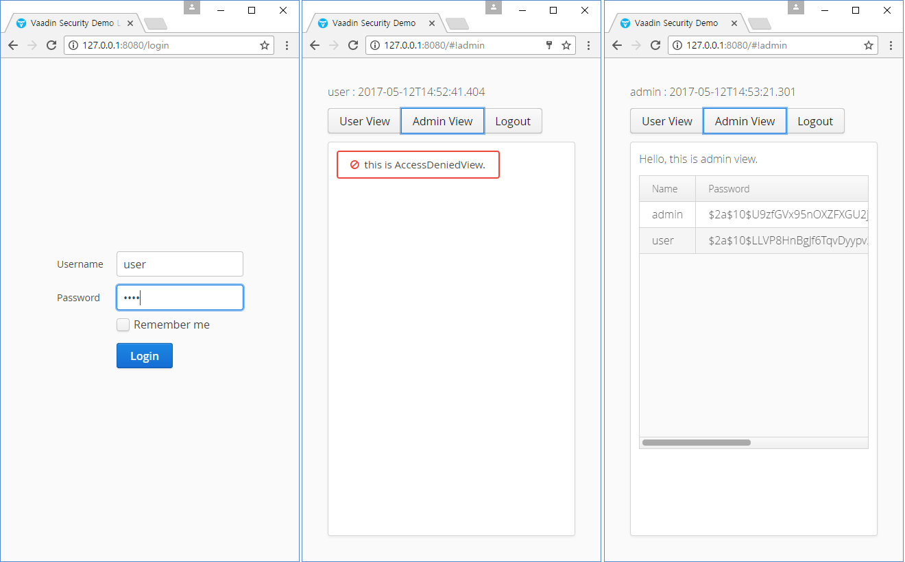

:vaadin4spring-github: https://github.com/peholmst/vaadin4spring

=  Vaadin4Spring Security(+JPA) Example

{vaadin4spring-github}[Vaadin4Spring Github >]

## Building and running demo

Linux/Mac

[source,groovy,indent=0]
----
gradlew clean build
gradlew bootRun
----

Windows

[source,groovy,indent=0]
----
gradlew.bat clean build
gradlew.bat bootRun
----

Demo Server : http://127.0.0.1:8080

Demo Username/Password : user/1234 or admin/1234

== Building from source

requires Java SE 1.8+

requires Gradle 3.+

requires Vaadin 8.+

requires SpringBoot 1.4+

requires SpringSecurity 4.1+

== License & Author

Add-on is distributed under Apache License 2.0. For license terms, see LICENSE.txt.

